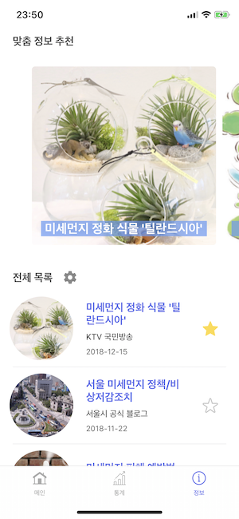

<p align="center">
  
  
  <a href="https://travis-ci.org/boostcamp3-iOS/team-c2" target="_blank">
    
  </a>
  <a href="https://codecov.io/gh/boostcamp3-iOS/team-c2" target="_blank">
    
  </a>
</p>

# 내안의먼지

부스트캠프 3기 iOS 과정 C-2팀

## 팀원 정보

⭐️ 튜터 오진성 [@intmain](https://github.com/intmain)

이재은 [@Jae-eun](https://github.com/Jae-eun)

이준상 [@zunzunzun](https://github.com/zunzunzun)

이한결 [@presto95](https://github.com/presto95)

## 기획

### 본인이 마신 미세먼지량을 알려주는 미세먼지 정보 앱

- 사용자가 실외에서 걸었던 거리에 따라 마신 미세먼지량을 알려줍니다.
- 미세먼지 축적량을 날짜별로 비교 가능하게 그래프로 보여줍니다.
- 미세먼지 관련 정보를 제공합니다.

## 디자인

### 스크린샷

| 화면                 | 스크린샷             |
| -------------------- | -------------------- |
| 메인 탭              |  |
| 통계 탭 - 미세먼지   |  |
| 통계 탭 - 초미세먼지 |  |
| 정보 탭              |  |
| 통계 탭 세부         |  |

### 컬러칩

-  #5F6FEE
-  #649AF8
-  #FF5561

## 개발

### 활용 기술

- **HealthKit** 사용하여 사용자의 걸음 수 및 거리 가져오기
- **국가대기오염정보 Open API** 사용하여 미세먼지 및 초미세먼지 정보 가져오기
- **Core Location** 사용하여 현재 위치의 위도 및 경도, 주소 가져오기
- **Core Data** 사용하여 미세먼지 축적량을 앱 내부에 보존하기
- **[SwiftLint](https://github.com/realm/SwiftLint)** 적용

```yaml
# .swiftlint.yml
disabled_rules:
- leading_whitespace
- trailing_whitespace

excluded:
- FineDust/Supporting Files/AppDelegate.swift
- FineDust/Supporting Files/GeoConverter.swift
- FineDustTests/
- FineDust/SWXMLHash

line_length:
  warning: 99
  error: 120

identifier_name:
  excluded:
    - x
    - y
```

- StyleShare의 **[Swift Style Guide](https://github.com/StyleShare/swift-style-guide)** 준수
- 에셋과 스토리보드 사용, 로컬라이징을 용이하게 하기 위해 **[SwiftGen](https://github.com/SwiftGen/SwiftGen)** 사용

```yaml
# swiftgen.yml
xcassets:
  inputs: FineDust/Supporting Files/Assets.xcassets
  outputs:
    templateName: swift4
    output: FineDust/SwiftGen/Assets.swift

ib:
  inputs: FineDust
  outputs:
    templateName: scenes-swift4
    output: FineDust/SwiftGen/Storyboard.swift

strings:
  inputs:
    - FineDust/Supporting Files/ko.lproj/Localizable.strings
  outputs:
    templateName: structured-swift4
    output: FineDust/SwiftGen/Strings.swift
```

- `project.pbxproj` 파일의 충돌을 최소화하고 해결을 쉽게 하기 위해 **[xUnique](https://github.com/truebit/xUnique)** 사용

### Unit Test / Dependency Injection

[Wiki](https://github.com/boostcamp3-iOS/team-c2/wiki/Unit-Test)를 참고해 주세요.

### Profile

[Wiki](https://github.com/boostcamp3-iOS/team-c2/wiki/Profile)를 참고해 주세요.
