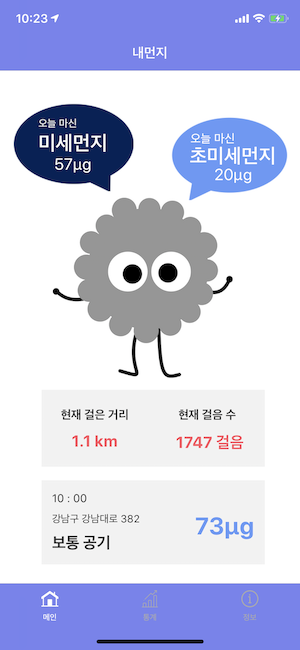
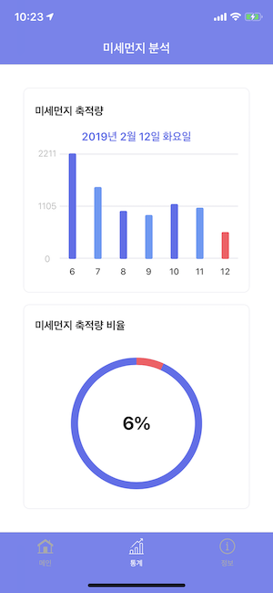

# Project FineDust


[](https://travis-ci.org/boostcamp3-iOS/team-c2)

부스트캠프 3기 iOS과정 C-2팀

## 팀원 정보

**[intmain](https://github.com/intmain)**

[Jae-eun](https://github.com/Jae-eun)

[zunzunzun](https://github.com/zunzunzun)

[presto95](https://github.com/presto95)

## 기획

### 본인이 마신 미세먼지량을 알려주는 미세먼지 정보 앱

- 사용자가 실외에서 걸었던 거리에 따라 마신 미세먼지량을 알려줍니다.
- 미세먼지 축적량을 날짜별로 비교 가능하게 그래프로 보여줍니다.
- 미세먼지 관련 정보를 제공합니다.

## 디자인

### 현재까지 구현된 뷰





### 컬러칩

-  #5F6FEE
-  #649AF8
-  #FF5561

## 개발

### 활용 기술

- **HealthKit** 사용하여 사용자의 걸음 수 및 거리 가져오기
- **국가대기오염정보 Open API** 사용하여 미세먼지 및 초미세먼지 정보 가져오기
- **Core Location** 사용하여 현재 위치의 위도 및 경도, 주소 가져오기
- **Core Data** 사용하여 미세먼지 축적량을 앱 내부에 보존하기

---

- **[SwiftLint](https://github.com/realm/SwiftLint)** 적용

```yaml
# .swiftlint.yml
disabled_rules:
- leading_whitespace
- trailing_whitespace
- nesting

excluded:
- FineDust/Supporting Files/AppDelegate.swift
- FineDust/Supporting Files/GeoConverter.swift

line_length:
  warning: 99
  error: 120

identifier_name:
  excluded:
    - x
    - y
```

- StyleShare의 **[Swift Style Guide](https://github.com/StyleShare/swift-style-guide)** 준수
- 스토리보드 및 에셋 사용을 용이하게 하기 위해 **[SwiftGen](https://github.com/SwiftGen/SwiftGen)** 사용

```yaml
# swiftgen.yml
xcassets:
  inputs: FineDust/Supporting Files/Assets.xcassets
  outputs:
    templateName: swift4
    output: Assets.swift

ib:
  inputs: FineDust
  outputs:
    templateName: scenes-swift4
    output: Storyboard.swift
```

- `project.pbxproj` 파일의 충돌을 최소화하고 해결을 쉽게 하기 위해 **[xUnique](https://github.com/truebit/xUnique)** 사용
